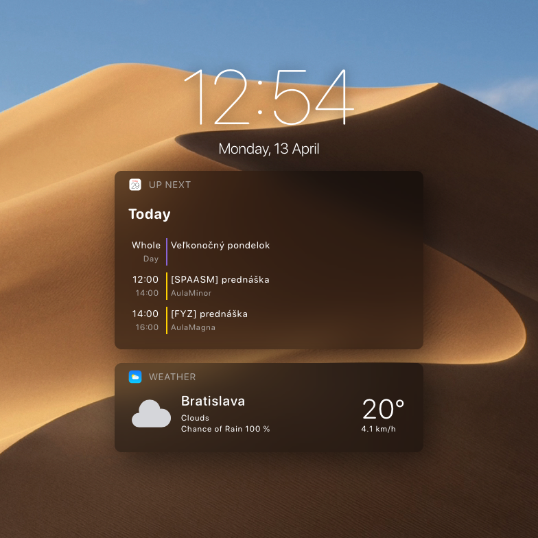

# iOS widget section
A simple iOS styled widget section for Übersicht. The reason of its creation was that i'm used to those widgets on my iPhone so i decided to recreate them for my computer. And also fun little project in JavaScript/CoffeScript.




## Features
**Clock**

This one shows accurate time and Date as well

**Up next**

Displays next events in your calendar

**Weather**

Displays weather information such as temperatur, chance of rain, condition and also wind speed.

 
## Instalation
1. Download and install Übersicht from their [website](http://tracesof.net/uebersicht/)
2. Clone this repository or download a [zip file](ubersicht-ios-clock-upnext-weather.widget.zip)
```
git clone https://github.com/vecnehladny/ubersicht-ios-clock-upnext-weather ~/Library/Application\ Support/Übersicht/widgets/ubersicht-ios-clock-upnext-weather/
```
3. Set up variables for Calendar and Weather

## Requirements
1. [icalBuddy](https://github.com/ali-rantakari/icalBuddy)
```
brew install ical-buddy
```
2. Account at [OpenWeather](https://openweathermap.org) and also API key
3. Set up an interaction shortcut in Übersicht Preferences, so you can scroll in widgets

## Customization
You can do some basic customizations in the each of the widgets files. There is a description so feel free to play around. Or just dig into the files and come up with something of your own.

## Enjoy!
Fork it, learn with it, do whatever with it. Just remember to have fun!

Also, big thanks to the iOS which gave me inspiration to these 🤠

